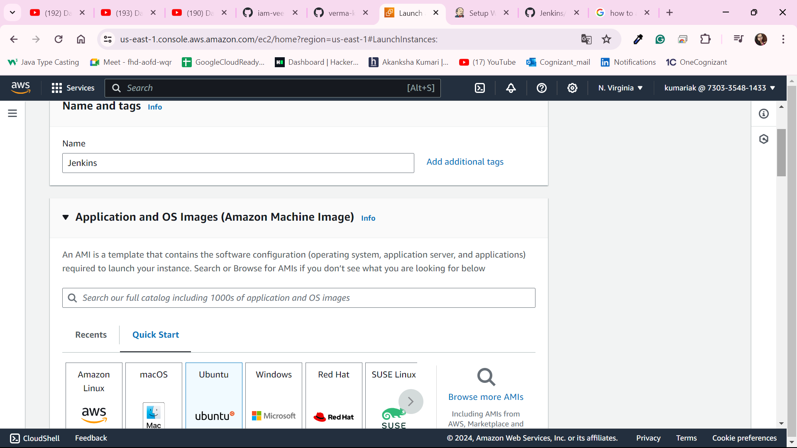

# Jenkins
Install Jenkins, Configure Docker, Setting up CI/CD, Deploy applications to k8s.

# Followig steps were followed by referring to informative video by abhishekveeramalla https://www.youtube.com/watch?v=zZfhAXfBvVA&list=PLdpzxOOAlwvIKMhk8WhzN1pYoJ1YU8Csa&index=23  

### STEP 1 : CREATING AWS EC2 INSTANCE
Need to go to AWS Console > Instances(running) > Click on the Launch instance button > Fill in all the required details for configuring the instance > Click Launch Instance

